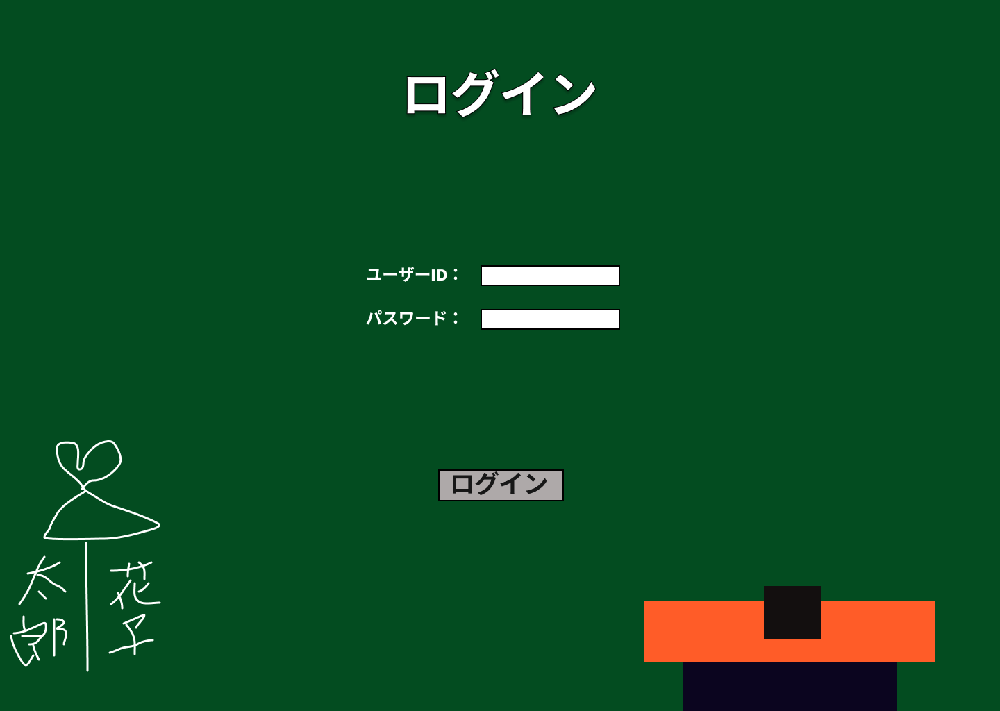

### 画面詳細図
## ユーザーログイン
### プロトタイプは以下のリンク先
[プロトタイプ](https://www.figma.com/file/EC6HJax9FH50cwnpwUmhDG/Untitled?node-id=10%3A16)
*****

*****

| ID | 要素 | 内容　|　アクション　|　イベント　|　対応DB　|
|----|------|------|-------------|-----------|---------|
|1   |表題|項目名表示|-       |-         |-         |
|2   |ユーザー名|入力欄|テキスト入力|-         |〇|
|3   |パスワード|入力欄|テキスト入力|-|〇|
|4   |ログイン|ボタン|クリック|ログイン処理|〇|
|5   |落書き|画像|-|-|-|
|6   |黒板消し|画像|-|-|-|
