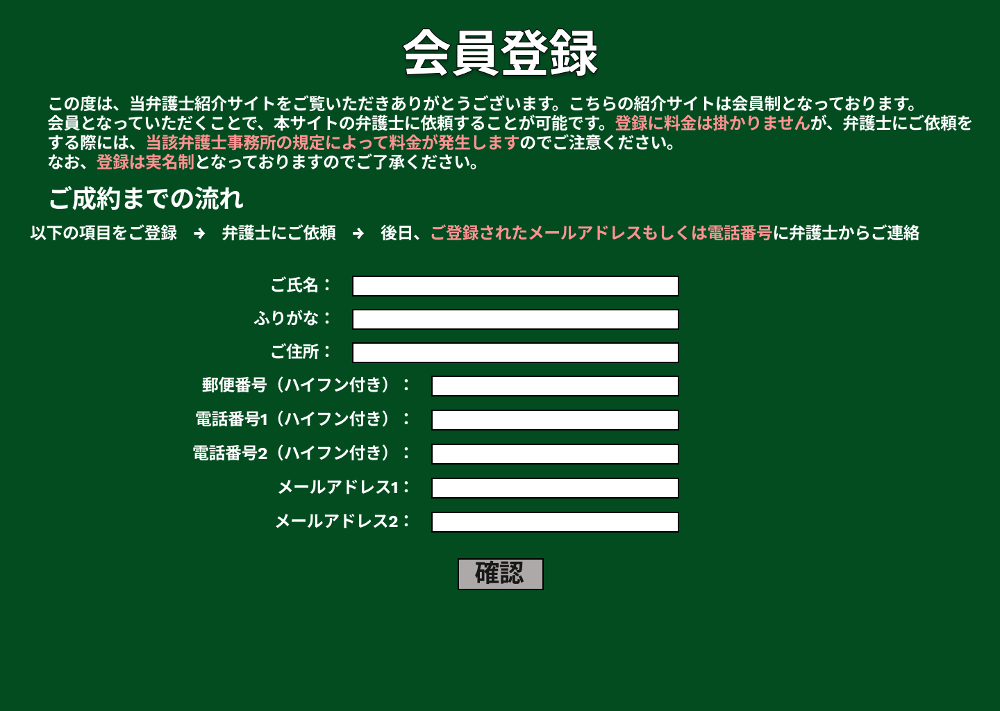

### 画面詳細図
## ユーザー登録
### プロトタイプは以下のリンク先
[プロトタイプ](https://www.figma.com/file/EC6HJax9FH50cwnpwUmhDG/Untitled?node-id=10%3A16)
*****

*****

| ID | 要素 | 内容　|　アクション　|　イベント　|　対応DB　|
|----|------|------|-------------|-----------|---------|
|1   |表題|項目名表示|-       |-         |-         |
|2   |文章|テキスト表示|-       |-         |-         |
|3   |成約の流れ|テキスト表示|-       |-         |-         |
|4   |成約小文|テキスト表示|-       |-         |-         |
|5   |ご氏名|入力欄|テキスト入力|-|〇|
|6   |ふりがな|入力欄|テキスト入力|-|〇|
|7   |ご住所|入力欄|テキスト入力|-|〇|
|8   |郵便番号|入力欄|テキスト入力|-|〇|
|9   |電話番号1|入力欄|テキスト入力|-|〇|
|10  |電話番号2|入力欄|テキスト入力|-|〇|
|11  |メールアドレス1|入力欄|テキスト入力|-|〇|
|12  |メールアドレス2|入力欄|テキスト入力|-|〇|
|15  |確認|ボタン|クリック|登録内容確認へ遷移|〇|
