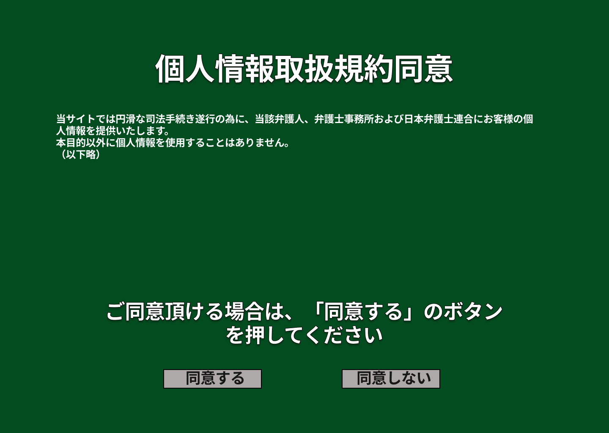

### 画面詳細図
## 検索結果
### プロトタイプは以下のリンク先
[プロトタイプ](https://www.figma.com/file/EC6HJax9FH50cwnpwUmhDG/Untitled?node-id=10%3A16)
*****

*****

| ID | 要素 | 内容　|　アクション　|　イベント　|　対応DB　|
|----|------|------|-------------|-----------|---------|
|1   |バナー|項目名|-       |-         |-         |
|2   |文章|テキスト表示|-|-         |-         |
|3   |同意する|ボタン|クリック|依頼処理実行|〇|
|4   |同意しない|画像ボタン|クリック|検索処理実行|〇|

