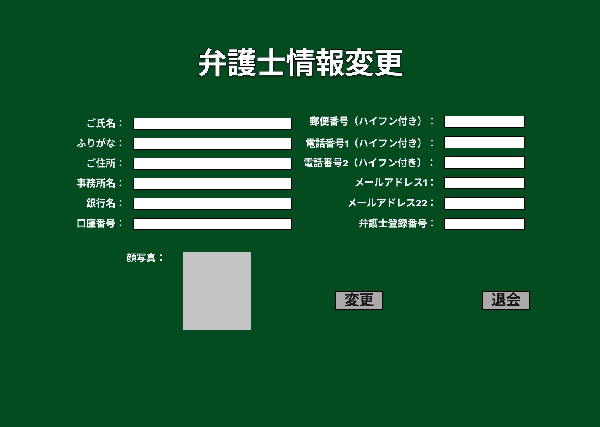

### 画面詳細図
## 弁護士情報変更
### プロトタイプは以下のリンク先
[プロトタイプ](https://www.figma.com/file/EC6HJax9FH50cwnpwUmhDG/Untitled?node-id=10%3A16)
*****

*****

| ID | 要素 | 内容　|　アクション　|　イベント　|　対応DB　|
|----|------|------|-------------|-----------|---------|
|1   |表題|項目名表示|-       |-         |-         |
|2   |ご氏名|入力欄|テキスト入力|-|〇|
|3   |ふりがな|入力欄|テキスト入力|-|〇|
|4   |ご住所|入力欄|テキスト入力|-|〇|
|5   |事務所名|入力欄|テキスト入力|-|〇|
|6   |銀行名|入力欄|テキスト入力|-|〇|
|7   |口座番号|入力欄|テキスト入力|-|〇|
|8   |郵便番号|入力欄|テキスト入力|-|〇|
|9   |電話番号1|入力欄|テキスト入力|-|〇|
|10  |電話番号2|入力欄|テキスト入力|-|〇|
|11  |メールアドレス1|入力欄|テキスト入力|-|〇|
|12  |メールアドレス2|入力欄|テキスト入力|-|〇|
|13  |弁護士登録番号|入力欄|テキスト入力|-|〇|
|14  |顔写真|顔写真添付欄|画像添付|-|〇|
|15  |確認|ボタン|クリック|弁護士マイページへ遷移|〇|
|16  |退会|ボタン|クリック|退会手続きへ遷移|〇|

