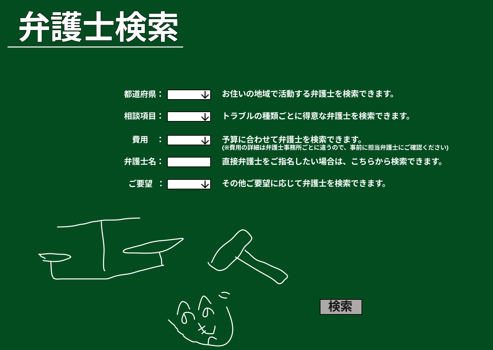

### 画面詳細図
## 弁護士検索
### プロトタイプは以下のリンク先
[プロトタイプ](https://www.figma.com/file/EC6HJax9FH50cwnpwUmhDG/Untitled?node-id=10%3A16)
*****

*****

| ID | 要素 | 内容　|　アクション　|　イベント　|　対応DB　|
|----|------|------|-------------|-----------|---------|
|1   |バナー |項目名表示|-       |-         |-         |
|2   |都道府県|ドロップダウンリスト|選択|-         |〇         |
|3   |相談項目|ドロップダウンリスト|選択|-|〇|
|4   |費用|ドロップダウンリスト|選択|-|〇|
|5   |弁護士名|入力欄|テキスト入力|弁護士向けページへ遷移|〇|
|6   |ご要望|ドロップダウンリスト|クリック|-|〇|
|7   |落書き|画像表示|-       |-         |-         |
|8   |検索|ボタン|クリック|検索処理実行|〇|

