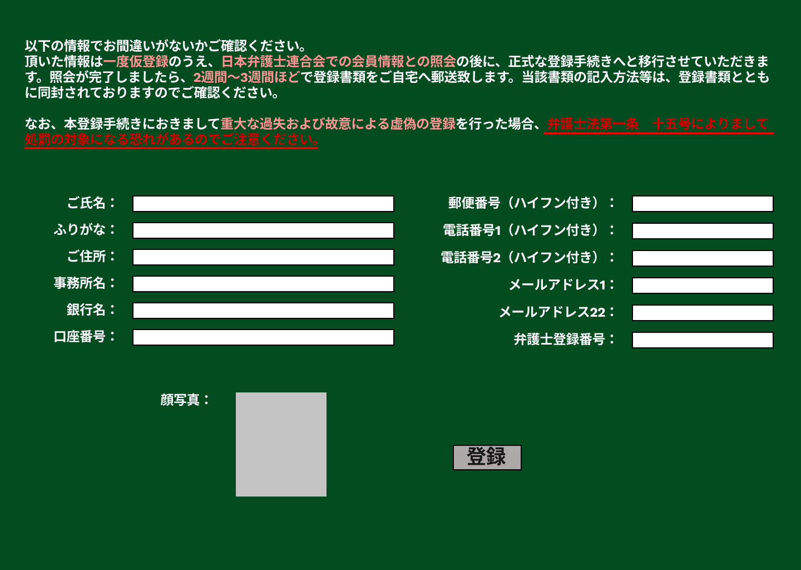

### 画面詳細図
## 弁護士登録確認
### プロトタイプは以下のリンク先
[プロトタイプ](https://www.figma.com/file/EC6HJax9FH50cwnpwUmhDG/Untitled?node-id=10%3A16)
*****

*****

| ID | 要素 | 内容　|　アクション　|　イベント　|　対応DB　|
|----|------|------|-------------|-----------|---------|
|1   |文章|テキスト表示|-       |-         |-         |
|2   |ご氏名|テキスト表示|前ページ内容表示|-|〇|
|3   |ふりがな|テキスト表示|前ページ内容表示|-|〇|
|4   |ご住所|テキスト表示|前ページ内容表示|-|〇|
|5   |事務所名|テキスト表示|前ページ内容表示|-|〇|
|6   |銀行名|テキスト表示|前ページ内容表示|-|〇|
|7   |口座番号|テキスト表示|前ページ内容表示|-|〇|
|8   |郵便番号|テキスト表示|前ページ内容表示|-|〇|
|9   |電話番号1|テキスト表示|前ページ内容表示|-|〇|
|10  |電話番号2|テキスト表示|前ページ内容表示|-|〇|
|11  |メールアドレス1|テキスト表示|前ページ内容表示|-|〇|
|12  |メールアドレス2|テキスト表示|前ページ内容表示|-|〇|
|13  |弁護士登録番号|テキスト表示|前ページ内容表示|-|〇|
|14  |顔写真|画像|前ページ画像表示|-|〇|
|15  |修正|ボタン|クリック|弁護士登録へ遷移|〇|
|15  |登録|ボタン|クリック|弁護士仮登録完了へ遷移|〇|
