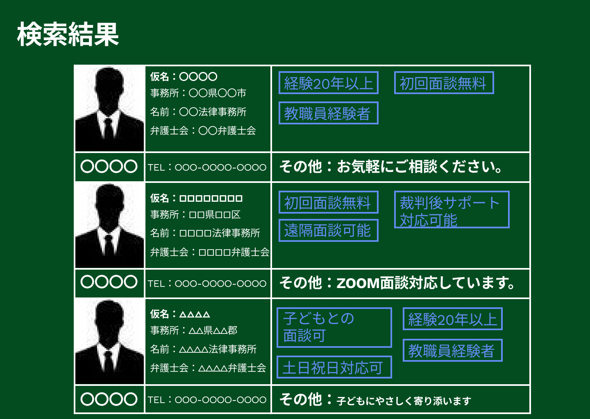

### 画面詳細図
## 検索結果
### プロトタイプは以下のリンク先
[プロトタイプ](https://www.figma.com/file/EC6HJax9FH50cwnpwUmhDG/Untitled?node-id=10%3A16)
*****

*****

| ID | 要素 | 内容　|　アクション　|　イベント　|　対応DB　|
|----|------|------|-------------|-----------|---------|
|1   |バナー |項目名表示|-       |-         |-         |
|2   |プロフィール|テキスト表示|-|-         |〇         |
|3   |氏名1（例）|テキスト表示|クリック|弁護士プロフィール1へ遷移|〇|
|4   |氏名2（例）|テキスト表示|クリック|弁護士プロフィール2へ遷移|〇|
|5   |氏名3（例）|テキスト表示|クリック|弁護士プロフィール3へ遷移|〇|
|6   |顔写真1（例）|画像ボタン|クリック|弁護士プロフィール1へ遷移|〇|
|7   |顔写真2（例）|画像ボタン|クリック|弁護士プロフィール2へ遷移|〇|
|8   |顔写真3（例）|画像ボタン|クリック|弁護士プロフィール3へ遷移|〇|
|9   |電話番号|テキスト表示|-|-|〇|
|10   |一言|テキスト表示|-|-|〇|
|11   |タグ|画像ボタン|クリック|検索処理実行|〇|

