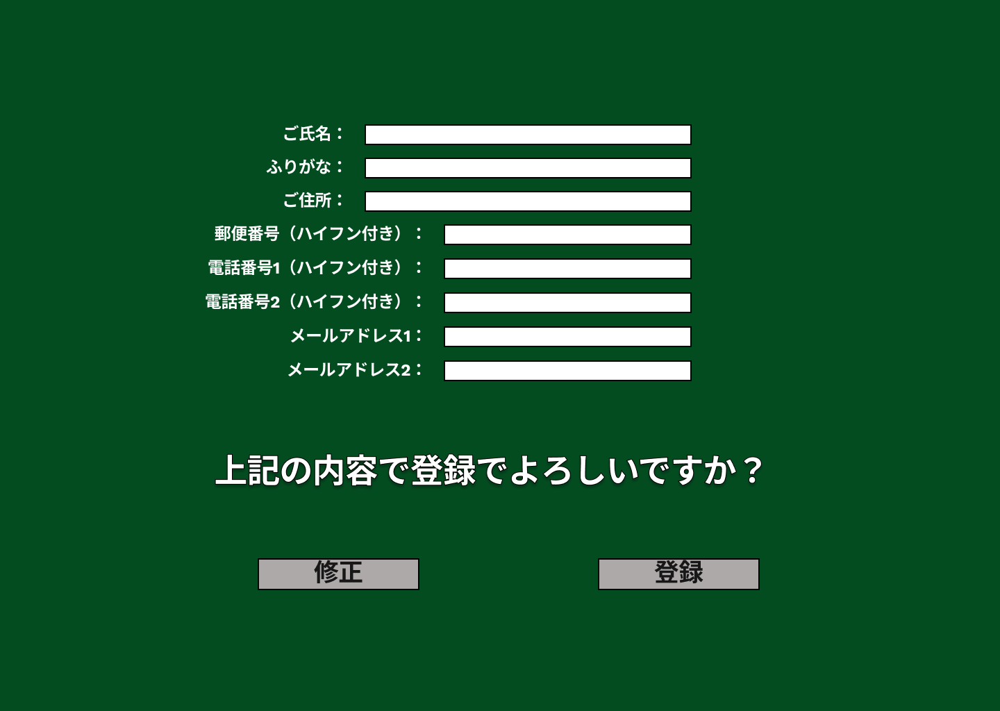

### 画面詳細図
## 登録内容確認
### プロトタイプは以下のリンク先
[プロトタイプ](https://www.figma.com/file/EC6HJax9FH50cwnpwUmhDG/Untitled?node-id=10%3A16)
*****

*****

| ID | 要素 | 内容　|　アクション　|　イベント　|　対応DB　|
|----|------|------|-------------|-----------|---------|
|1   |ご氏名|テキスト表示|入力内容確認|-|〇|
|2   |ふりがな|テキスト表示|入力内容確認|-|〇|
|3   |ご住所|テキスト表示|入力内容確認|-|〇|
|4   |郵便番号|テキスト表示|入力内容確認|-|〇|
|5   |電話番号1|テキスト表示|入力内容確認|-|〇|
|6  |電話番号2|テキスト表示|入力内容確認|-|〇|
|7  |メールアドレス1|テキスト表示|入力内容確認|-|〇|
|8  |メールアドレス2|テキスト表示|入力内容確認|-|〇|
|9  |修正|ボタン|クリック|ユーザー登録へ遷移|〇|
|10  |確認|ボタン|クリック|ユーザー登録処理|〇|
