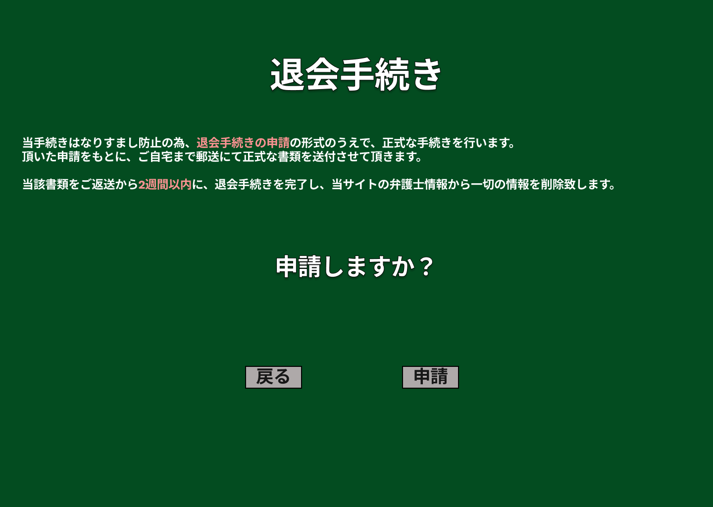

### 画面詳細図
## 退会手続き
### プロトタイプは以下のリンク先
[プロトタイプ](https://www.figma.com/file/EC6HJax9FH50cwnpwUmhDG/Untitled?node-id=10%3A16)
*****

*****

| ID | 要素 | 内容　|　アクション　|　イベント　|　対応DB　|
|----|------|------|-------------|-----------|---------|
|1   |表題|項目名表示|-       |-         |-         |
|2   |文章|テキスト表示|-|-|-|
|3   |申請しますか|テキスト表示|-|-|-|
|4   |戻る|ボタン|クリック|弁護士情報変更へ遷移|-|
|5   |申請|ボタン|クリック|仮退会処理|〇|
