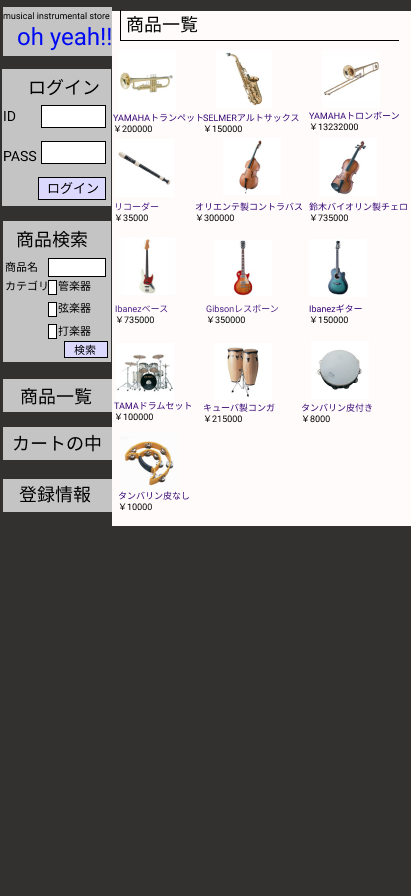

### 画面詳細図
## トップページ
### プロトタイプは以下のリンク先
[プロトタイプ](https://www.figma.com/file/EC6HJax9FH50cwnpwUmhDG/Untitled?node-id=1%3A2)
*****

*****

| ID | 要素 | 内容　|　アクション　|　イベント　|　対応DB　|
|----|------|------|-------------|-----------|---------|
|1   |バナー |サイト名表示|-       |-         |-         |
|2   |ログイン|テキスト画像|-       |-         |-         |
|3   |バナー |サイト名表示|-       |-         |-         |
|4   |ログイン|テキスト画像|-       |-         |-         |
|5   |バナー |サイト名表示|-       |-         |-         |
|6   |ログイン|テキスト画像|-       |-         |-         |
|7   |バナー |サイト名表示|-       |-         |-         |
|8   |ログイン|テキスト画像|-       |-         |-         |
|9   |バナー |サイト名表示|-       |-         |-         |
|10   |ログイン|テキスト画像|-       |-         |-         |
|11   |バナー |サイト名表示|-       |-         |-         |
|12   |ログイン|テキスト画像|-       |-         |-         |
|13   |バナー |サイト名表示|-       |-         |-         |
|14   |ログイン|テキスト画像|-       |-         |-         |
|15   |バナー |サイト名表示|-       |-         |-         |
|16   |ログイン|テキスト画像|-       |-         |-         |
|17   |バナー |サイト名表示|-       |-         |-         |
|18   |ログイン|テキスト画像|-       |-         |-         |
|19   |ログイン|テキスト画像|-       |-         |-         |
|20   |バナー |サイト名表示|-       |-         |-         |
|21   |ログイン|テキスト画像|-       |-         |-         |
|22   |バナー |サイト名表示|-       |-         |-         |
|23   |ログイン|テキスト画像|-       |-         |-         |
